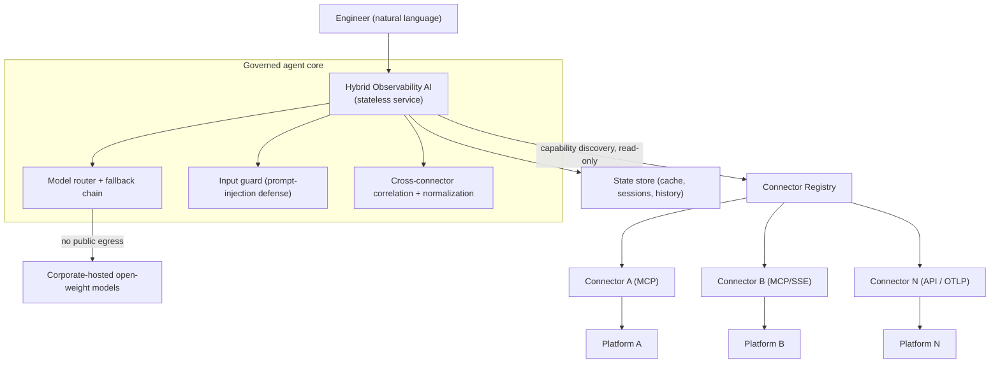

# Hybrid Observability AI

**A connector-agnostic, no-egress agentic framework for unified full-stack observability with on-premises and cloud LLMs.**

[](./LICENSE)
[](./WHITEPAPER.md)
<!-- [](https://arxiv.org/abs/XXXX.XXXXX) -->

Ask one natural-language question and get a correlated answer across **every** observability
platform you run — with **all inference on models you host yourself**, so no telemetry ever
leaves your environment.

> This repository is a **reference implementation and SDK** for the framework described in the
> [whitepaper](./WHITEPAPER.md). Named platforms are *examples of the connector contract*, not
> the framework's identity.

---

## Why

In large organizations, **autonomous application streams each choose their own best-of-breed
observability stack** — one team on an APM/tracing suite, another on a log platform, another on
metrics, infrastructure in the cloud provider's monitoring. This isn't a misconfiguration to
centralize away; it's the steady state. So a single distributed transaction scatters correlated
signals across 4–5 platforms, and incident response becomes manual console-stitching.

The obvious fix is an LLM assistant — except regulated environments **cannot** send production
telemetry to a public LLM API.

**Hybrid Observability AI** resolves both: *correlate, don't consolidate* — via a pluggable
connector model — and run entirely on **corporate-hosted open-weight models** with a strict
no-public-egress guarantee.

## Architecture



Each platform plugs in through a **self-describing [Observability Connector](./docs/CONNECTOR_SDK.md)**
that advertises its capabilities at runtime — so onboarding a new tool is *configuration, not code*.

## Features

- **Connector-agnostic** — MCP, API-adapter, or OTLP connectors; add a platform by editing
  `connectors.yaml`, no agent code change.
- **No public-AI egress** — inference confined to models you host; governed fallback chain.
- **Cross-platform correlation** — one transaction, one cited answer, normalized to an
  OpenTelemetry-aligned schema.
- **Progressive-disclosure skills** — portable `SKILL.md` domain packs loaded on demand
  (keeps the prompt lean).
- **Production-hardened for open-weight LLMs** — context-window auto-capping, hidden-reasoning
  handling, model routing. (See [`reference_agent/`](./reference_agent/).)
- **Evaluation harness** — grounding/robustness/latency metrics ([`eval/`](./eval/)).

## Quickstart

**1. Add a connector** (no code for MCP):
```yaml
# connectors.yaml  (see connectors/connectors.example.yaml)
connectors:
  - id: platform-a
    transport: mcp
    url: "http://mcp-platform-a:PORT/mcp"
```

**2. Implement a custom connector** (only if there's no MCP server) — subclass the ABC:
```python
from connectors.base import ObservabilityConnector      # see connectors/example_api.py
```

**3. Wire the hardening patterns** into your agent loop:
```python
from reference_agent.context import cap_context_budget, should_disable_thinking, resolve_content
from reference_agent import skills   # progressive-disclosure SKILL.md loader
```

**4. Evaluate**:
```bash
BASE_URL=http://localhost:8000 python3 eval/run_eval.py
```

## Repository layout

| Path | What |
|---|---|
| [`WHITEPAPER.md`](./WHITEPAPER.md) | The paper (problem → architecture → mechanisms → evaluation) |
| [`docs/CONNECTOR_SDK.md`](./docs/CONNECTOR_SDK.md) | The Observability Connector specification |
| [`connectors/`](./connectors/) | Connector ABC, registry, example connector, `connectors.example.yaml` |
| [`reference_agent/`](./reference_agent/) | Generalizable patterns: skills loader, context auto-cap, thinking-channel handling |
| [`skills/`](./skills/) | Portable `SKILL.md` domain packs (examples) |
| [`eval/`](./eval/) | Reproducible evaluation harness + labeled dataset |
| [`examples/k8s/`](./examples/k8s/) | Deployment templates (placeholders; secure posture) |

## Engineering lessons (the parts that actually mattered)

Running open-weight, multi-LLM agents in production surfaced failure modes rarely discussed:

- **Context overflow → non-convergence** — an input budget larger than the model window silently
  truncated the *system prompt*; fixed by tying the budget to `num_ctx`.
- **Hidden reasoning tokens → empty answers** — a model routed all output to a "thinking" channel;
  disable it for that family.
- **Prompt bloat** — always-on guidance degraded smaller models → progressive-disclosure skills.
- **Conversation-history poisoning** — replayed stale refusals anchored the model.
- **Transport hardening** — a vendor MCP server's DNS-rebinding protection needed a `Host` override.

Details in the [whitepaper](./WHITEPAPER.md) §5.

## Citation

See [`CITATION.cff`](./CITATION.cff). Once the preprint is live, cite the arXiv version.

## License

[Apache-2.0](./LICENSE) © 2026 Surya Narayana Murthy Vemuri.

## Disclaimer

A reference implementation of a generalized framework. It ships no vendor credentials, hostnames,
or tenant details; provide your own via secrets. Named platforms illustrate the connector contract.
