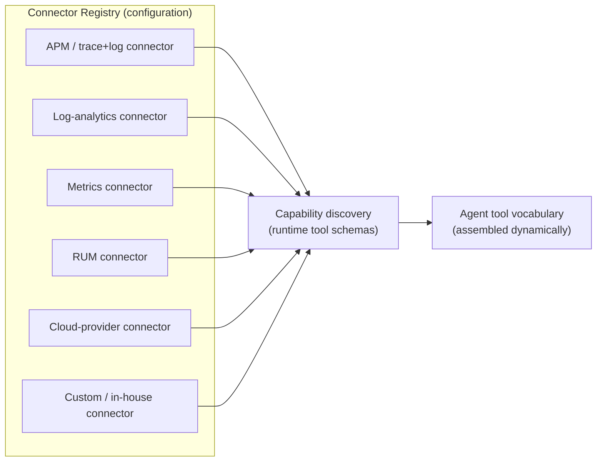
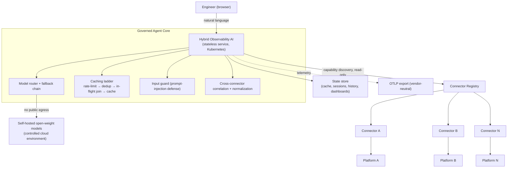
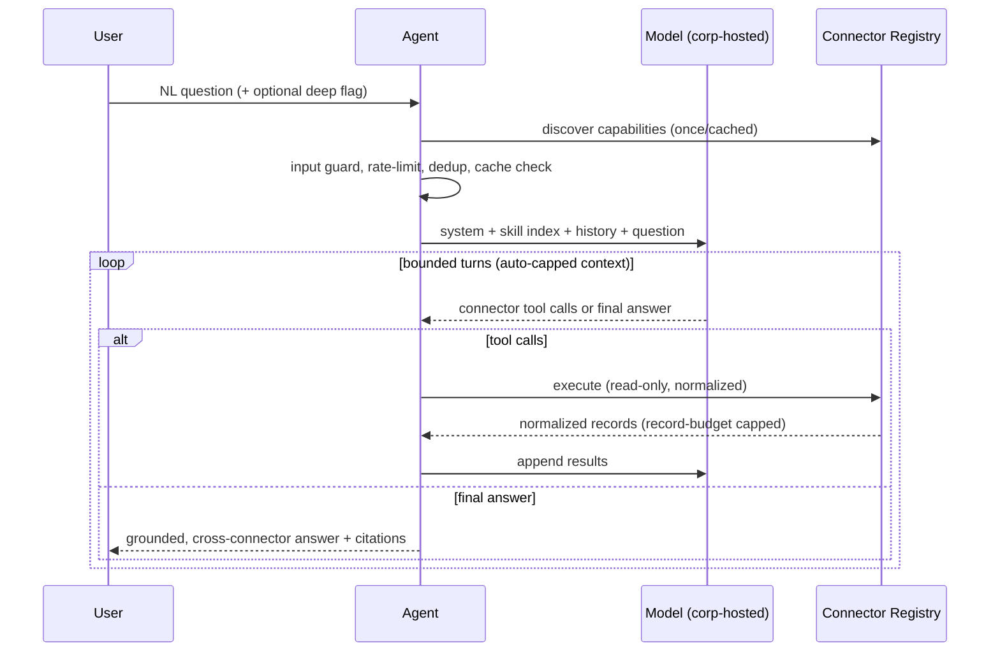

# Hybrid Observability AI: A Connector-Agnostic, No-Egress Agentic Framework for Unified Full-Stack Observability with Self-Hosted and Cloud LLMs

**Author(s):** Surya Narayana Murthy Vemuri, Independent Researcher
**Correspondence:** svemurilv@gmail.com
**Version:** 2.0 · **Date:** July 2026
**Keywords:** LLMOps, observability, agentic AI, pluggable connectors, capability discovery, self-hosted LLM, model routing, OpenTelemetry, data residency, MCP

---

## Abstract

Enterprises operate full-stack observability across many heterogeneous, siloed platforms—APM/tracing, logs, metrics, real-user monitoring, and cloud-provider infrastructure services—each with its own query language and console. During incident response this fragmentation forces manual, cross-console correlation and raises mean-time-to-resolution. Applying Large Language Models (LLMs) is further constrained in regulated environments by data-residency rules that forbid sending telemetry to public LLM APIs. We present **Hybrid Observability AI**, a production-deployed, **connector-agnostic** framework that unifies *any* set of observability platforms behind a single natural-language interface while performing all inference on **self-hosted open-weight models** with a strict **no-public-egress** guarantee. The central design contribution is a **pluggable, self-describing Observability Connector model**: each platform is integrated through a standard adapter that advertises its own capabilities at runtime, so onboarding a new observability tool is *configuration, not code*—a "hands-free" integration path. Around this core we contribute mechanisms that make open-weight, multi-LLM agents reliable in production: a governed connector/tool layer, a progressive-disclosure skill loader, context-window auto-capping, hidden-reasoning-channel handling, model routing with fallback, and an evidence-grounded deep-analysis mode. A reference deployment integrates three connector classes (an APM/trace-and-log platform, a logs/metrics/dashboards platform, and a cloud-provider metrics/logs service) and generalizes to others (e.g., Datadog, New Relic, Splunk, Elastic, Honeycomb). We report preliminary single-tenant operating characteristics (cached responses ≈150 ms; live cross-platform answers ≈20–30 s; deep multi-source reports ≈3–4 min; no per-token inference cost), catalog the engineering challenges of hybrid self-hosted multi-LLM operation, and propose an evaluation methodology grounded in the 2026 LLMOps framework ecosystem.

---

## 1. Introduction

### 1.1 The fragmentation problem, generalized

In large organizations, **autonomous application streams each choose and operate their own observability stack**—driven by team autonomy, best-of-breed preferences, mergers and acquisitions, and Conway's law. One stream may standardize on an APM/tracing suite, another on a log-analytics platform, another on a metrics stack, while infrastructure telemetry lands in a cloud-provider monitoring service. This is not a misconfiguration to be centralized away; it is the steady-state reality of modern estates, and attempts at forced consolidation routinely fail.

Consequently, a single distributed transaction emits correlated signals across *several* platforms at once: traces and application logs into an **APM platform**, logs into a **log-analytics platform**, time-series into a **metrics platform**, session data into a **RUM platform**, and infrastructure counters into a **cloud-provider monitoring service**. No single platform holds the whole picture. An engineer investigating an incident must know *which* platform each stream chose, *how* to query it, and then *manually* correlate results across consoles—precisely the cross-platform cognitive load that inflates mean-time-to-resolution.

The problem is not specific to any vendor; it is structural to best-of-breed observability estates. A useful assistant must therefore be **platform-agnostic**: able to integrate whatever stacks an organization's streams already run, correlate a transaction across them, and add new ones without re-engineering.

### 1.2 The data-residency constraint

LLM assistants are the natural remedy, but regulated enterprises impose a hard constraint: **production telemetry—often containing customer identifiers and transaction detail—must not leave the organization's controlled environment.** This rules out the default architecture of commercial "AI observability copilots," which route context to hosted foundation models. A viable system must confine inference to models the organization itself controls.

By **self-hosted** we mean models and the framework running in infrastructure the organization controls—its own AWS, Azure, or GCP account, or a data center—rather than a third-party AI provider. The term denotes *control and data residency*, not a specific location; the same deployment runs unchanged across any of these environments.

### 1.3 Contributions

1. **A connector-agnostic, self-describing integration model** (the *Observability Connector*), enabling hands-free onboarding of arbitrary observability platforms via runtime capability discovery (§3, §4.1).
2. **A no-egress agentic architecture** in which all inference runs on self-hosted open-weight models with a governed in-organization fallback chain and no path to public LLM APIs (§3, §4.2).
3. **A governed tool/connector layer** that exposes only read-only, capability-scoped operations to the agent (§4.3).
4. **A progressive-disclosure skill loader** that keeps the base prompt lean while remaining extensible (§4.4).
5. **Robustness mechanisms for open-weight, multi-LLM operation**: context-window auto-capping, hidden-reasoning-channel handling, and model routing/fallback (§4.5, §5).
6. **A connector-dispatched query and cross-connector correlation layer** with a vendor-neutral normalization schema (§4.6).
7. **An evidence-grounded deep-analysis mode** with anti-fabrication constraints suited to production operations (§4.7).
8. **A pragmatic evaluation methodology and framework survey** for benchmarking hybrid, self-hosted, multi-LLM observability systems (§6).

### 1.4 Scope and positioning

Hybrid Observability AI is **not** an LLM evaluation framework; it is an application/integration framework that such tools (DeepEval, Arize Phoenix, Langfuse, etc.) can evaluate. Named platforms in this paper are **reference connectors** illustrating the model, not the identity of the system.

---

## 2. Background and Related Work

### 2.1 AI-assisted observability
Vendor copilots typically operate within a single platform and route context to hosted models. Our work differs on two axes: it is **connector-agnostic** (correlating across arbitrary platforms) and **no-egress** (self-hosted inference).

### 2.2 LLMOps evaluation/observability frameworks
Table 1 summarizes frameworks relevant to hybrid, self-hosted, multi-LLM systems. They are **complementary**—the measurement layer we adopt for evaluation (§6), not competitors.

**Table 1. LLMOps evaluation/observability frameworks relevant to hybrid self-hosted multi-LLM systems (2026).**

| Framework | Primary role | Notable capabilities | OSS / self-host | Relevance to a hybrid + self-hosted setup |
|---|---|---|---|---|
| **DeepEval** | Unit-testing LLM apps/agents | 14+ metrics (hallucination, RAG), Pytest, LLM-as-judge | Yes | Offline testing of routing/agent pipelines; extensible to local models |
| **Arize Phoenix** | Observability + eval | Tracing, automated evals, groundedness detection, OpenTelemetry | Yes | Production monitoring of multi-LLM setups |
| **Langfuse** | End-to-end tracing & eval | Prompt mgmt, scoring, datasets, custom metrics | Yes (MIT) | Model-agnostic; works with local + hosted LLMs |
| **MLflow (LLM)** | Full lifecycle eval | Agent tracing, quality gates, LLM-as-judge | Yes | Hybrid/self-hosted + experiment tracking |
| **RAGAS** | RAG/retrieval eval | Faithfulness, context precision, answer relevance | Yes | Evaluates the retrieval/correlation path |
| **TruLens** | Feedback & quality | Groundedness, context relevance | Yes | Feeds observability dashboards |
| **Deepchecks** | Reliability & health | Bias, robustness, monitoring | Yes | Broader system health checks |
| **W&B Weave / Braintrust / Galileo / LangSmith / Helicone** | Tracing + eval | Experiment tracking, guardrails, agent observability | Varies | Team-scale evaluation and monitoring |

### 2.3 Interoperability substrates
Two open substrates make connector-agnosticism practical: the **Model Context Protocol (MCP)** as a governed, self-describing tool boundary, and **OpenTelemetry (OTLP)** as a vendor-neutral telemetry schema. Our connector model builds on both.

---

## 3. The Observability Connector Model

The framework's core abstraction is the **Observability Connector**: a uniform adapter that lets the agent read from one platform without any platform-specific code in the agent itself.

### 3.1 Connector contract

Every connector implements a small, uniform contract:

- **Capability discovery** — the connector advertises the read operations it supports (its tool schemas) at runtime. The agent assembles its usable tool vocabulary by querying each registered connector, so **adding a platform requires no agent code change**.
- **Read-only query surface** — parameterized operations (search logs, query metrics, list entities/log groups, fetch problems/anomalies, etc.), scoped to read.
- **Normalization** — the connector maps its native records into a **vendor-neutral, OpenTelemetry-aligned schema** (timestamp, severity, service/workload, resource attributes, message/body, source), enabling cross-connector correlation.
- **Health/identity** — the connector reports connectivity and auth status for the system dashboard.

### 3.2 Connector types

Connectors are realized through any of three interoperable transports, in decreasing order of "hands-free-ness":

1. **MCP connector** — the platform (or a thin sidecar) exposes an MCP server; capability discovery is automatic via the protocol. This is the preferred, zero-code path.
2. **API connector** — a lightweight adapter wraps a platform's query API and declares its schemas.
3. **OTLP connector** — the platform emits/consumes OpenTelemetry; the framework ingests normalized signals directly.

### 3.3 Reference connectors (illustrative)

The reference deployment registers three connector classes—an APM/trace-and-log platform, a logs/metrics/dashboards platform (log-analytics + time-series + cloud-provider infrastructure metrics through its datasource layer)—and the model generalizes to Datadog, New Relic, Splunk, Elastic, Honeycomb, Prometheus-native stacks, and in-house systems. **Named platforms are examples of the contract, not the product's identity.**

### 3.4 Hands-free onboarding

Because connectors self-describe, onboarding a new platform is: (1) register the connector (an MCP endpoint, an API adapter, or an OTLP source) in the registry; (2) the agent discovers its capabilities and adds them to its tool vocabulary; (3) optional portable **skill packs** (§4.4) supply platform-specific query recipes as plain documents. No agent redeployment is required for step (2).

---

## 4. Architecture and Key Mechanisms

### 4.1 System overview

### 4.2 No-egress inference and model routing
Requests are served by a **primary open-weight model** with an ordered **fallback chain**, all self-hosted. Per-request model choice is allowed only from an **allowlist** enforced at the API boundary and again in the agent. A circuit breaker fails fast on backend unavailability. Crucially, **no code path reaches a public LLM.**

### 4.3 Governed connector/tool layer
The agent holds no broad platform credentials; it invokes only the read-only operations that connectors advertise. This bounds the blast radius to read operations over a fixed, discoverable vocabulary, independent of which platforms are connected.

### 4.4 Progressive-disclosure skills
Portable domain guidance (query recipes, service knowledge, connector-specific tips) is packaged as open-format documents. **Only a compact index is injected into the system prompt**; full guidance is retrieved on demand. This mitigates a real failure mode: folding all guidance into the base prompt degraded smaller open-weight models' ability to synthesize answers (§5.3). Skills are authored per connector as needed, keeping the framework extensible without code.

### 4.5 Robustness for open-weight, multi-LLM operation
- **Context-window auto-cap.** The input budget is tied to the model window so prompts cannot silently overflow and drop the system prompt (§5.1).
- **Hidden-reasoning-channel handling.** For hybrid reasoning models that route output to a separate "thinking" channel, the framework disables that channel (and falls back to surfacing it if content is otherwise empty) to avoid blank answers (§5.2).
- **Routing/fallback.** Graceful degradation across the model chain on error or outage.

### 4.6 Connector-dispatched query and correlation
A single natural-language question is decomposed and dispatched to whichever connectors are registered; results are normalized to the common schema and **correlated into one timeline/answer**, with citations back to source records. Because dispatch targets the *connector contract*, adding platforms extends coverage automatically. (The reference deployment includes practical fixes for real backend quirks—e.g., cloud-provider pagination limits and datasource-proxy filter semantics—encapsulated inside the respective connectors so the agent stays platform-agnostic.)

### 4.7 Evidence-grounded deep-analysis mode
A per-request mode raises tool/turn/output budgets and selects a stronger model to produce a structured, multi-layer report (identity, event topology, phase-by-phase verdict, anomaly inspection, latency reconstruction, health scorecard, executive conclusion). It enforces **hard grounding**: every value cites a real record; inferences/scores are labeled "(inferred, best-effort)"; unproven phases are marked "no evidence" rather than defaulting to pass—so the assistant never fabricates a confident but false operational narrative.

### 4.8 Memory and safety
Multi-turn history is persisted per user/session with bounded retention. A directive instructs the model to trust the latest tool result over prior turns, mitigating conversation-history poisoning (§5.4). User input is screened for prompt-injection before reaching the model.

---

## 5. Engineering Challenges in Hybrid Self-Hosted Multi-LLM Systems

Five production failure modes and their resolutions—each decisive for reliability yet under-discussed:

- **5.1 Context overflow → non-convergence.** An oversized input budget silently truncated the system prompt; the agent looped without synthesizing. *Fix:* window-tied auto-cap + leaner tool budget.
- **5.2 Hidden reasoning tokens → empty answers.** A reasoning model emitted only "thinking," leaving content empty. *Fix:* disable the thinking channel; fall back to it if needed.
- **5.3 Prompt bloat → degraded instruction-following.** Always-on large guidance halved usable capacity for a small model. *Fix:* progressive-disclosure skills.
- **5.4 Conversation-history poisoning.** Replayed stale refusals anchored the model. *Fix:* "trust latest tool result" directive; new-conversation reset.
- **5.5 Transport hardening of third-party connectors.** A vendor MCP server's DNS-rebinding protection rejected cross-service requests (HTTP 403). *Fix:* corrected host header and mount path—representative of integration friction that only appears in real deployments.

---

## 6. Evaluation Methodology

A two-tier strategy using Table 1 frameworks.

**6.1 Offline (pre-deployment).** With DeepEval/MLflow, assert on **quality** (faithfulness/groundedness, relevance, hallucination rate, coherence, citation coverage), **robustness** (routing/fallback correctness, refusal-suppression when a capability exists, injection resistance), and **retrieval/correlation quality** via RAGAS (contextual precision/recall of the evidence set).

**6.2 Online (post-deployment).** Instrument with OpenTelemetry; route traces to Arize Phoenix/Langfuse for **performance** (TTFT, TPOT, end-to-end latency, cache hit-rate, **cost/query**—key for self-hosted vs. cloud), **trace completeness**, **multi-connector correlation accuracy**, and sampled live groundedness/anomaly monitoring.

**6.3 Metric set.**

| Category | Metrics |
|---|---|
| Quality | faithfulness, relevance, hallucination rate, coherence, citation coverage |
| Performance | TTFT, TPOT, latency, throughput, cost/query (self-hosted vs. cloud) |
| Robustness | routing accuracy, fallback success, guardrail/injection resistance, convergence rate |
| Connector/observability | capability-discovery correctness, trace completeness, cross-connector correlation accuracy, anomaly-detection precision/recall |

---

## 7. Preliminary Results

> **Methodological note.** Figures below are **observed operating characteristics from a single-tenant deployment**, not a controlled benchmark; they convey order-of-magnitude behavior and motivate the formal evaluation of §6 (future work). We deliberately avoid unsupported comparative accuracy claims.

- **Latency (observed):** cached repeats ≈150 ms; live cross-connector answers (general model) ≈20–30 s at 2 agent turns; deep multi-source reports (stronger model) ≈3–4 min at ~3 turns.
- **Convergence:** typical live questions converge in 2 tool-use turns; the context auto-cap eliminated the observed non-convergence class.
- **Cost:** **no per-token inference cost** (self-hosted); marginal cost dominated by existing platform subscriptions and negligible durable-state storage.
- **Extensibility (observed):** new read capabilities became available to the agent through connector capability-discovery without agent code changes; portable skill packs added platform-specific recipes as documents.
- **Reliability fixes validated in deployment:** grounded deep-mode reports (no forced success narratives); correct wildcard entity/log search after connector-encapsulated backend fixes; restored third-party tool availability after transport hardening.

A rigorous benchmark—labeled suite, LLM-as-judge scoring, head-to-head latency/cost/accuracy under load, and connector-onboarding time—is the primary future-work item.

---

## 8. Deployment and Security Posture

- **Platform:** Kubernetes (reference: Amazon EKS); architecture-pinned images; horizontal autoscaling.
- **PodSecurity "restricted":** non-root, dropped capabilities, seccomp `RuntimeDefault`.
- **Secrets & supply chain:** secrets injected at runtime (never in images); CI/CD via short-lived OIDC (no static keys); gated promotion.
- **Read-only guarantee:** no write path to any connected platform; the connector vocabulary is read-only.
- **Data residency:** inference confined to self-hosted models; no public-AI egress.

---

## 9. Discussion, Limitations, Future Work

**Limitations.** (1) Results are preliminary and single-tenant. (2) Some connectors inherit backend limits (e.g., provider pagination caps) encapsulated but not eliminated. (3) Deep-analysis latency reflects a deliberate quality/latency trade-off. (4) Answer quality tracks the self-hosted model tier available.

**Future work.** (1) Formal evaluation per §6 with reproducible harnesses, including **connector-onboarding time** as a first-class metric. (2) Cost/latency-aware **dynamic model routing**. (3) An open **connector SDK** and certified reference connectors for major platforms. (4) Auto-sync of platform dashboard/panel definitions through connectors. (5) Additional signal classes (business events, RUM-derived signals) as connector capabilities. (6) Optional managed-LLM fallback preserving data-residency guarantees.

---

## 10. Conclusion

Hybrid Observability AI shows that a **connector-agnostic, no-egress, agentic** framework can unify arbitrary full-stack observability platforms behind a natural-language interface using only self-hosted open-weight models. The framework's durable contribution is the **self-describing Observability Connector model**—hands-free onboarding of any platform via runtime capability discovery—paired with concrete, reproducible engineering lessons for running open-weight, multi-LLM agents in production. We release the design to encourage adoption in regulated environments where data residency is non-negotiable, and we invite replication and formal benchmarking.

---

## Reproducibility and Artifacts
- Architecture, routing/auth, and query/prompt references accompany this paper.
- **Planned open-sourcing:** a sanitized reference implementation, a connector SDK, portable skill packs, and the §6 evaluation harness.

## Acknowledgments
_[Reviewers, collaborators, platform teams.]_

## References (to finalize for submission)
1. Confident AI. *DeepEval.* 2. Arize AI. *Phoenix.* 3. Langfuse. 4. MLflow LLM modules. 5. RAGAS. 6. TruLens. 7. Deepchecks. 8. Model Context Protocol specification. 9. OpenTelemetry specification. 10. Representative APM/log/metrics platform documentation (reference connectors).

---

### Appendix A. Agent tool-use loop (connector-agnostic)

### Appendix B. Adding a connector (hands-free path)
1. Register connector (MCP endpoint / API adapter / OTLP source) in the registry.
2. Framework performs capability discovery → agent tool vocabulary updated at runtime.
3. (Optional) Drop in a portable skill pack of query recipes for the new platform.
4. No agent code change or redeploy required for step 2.
